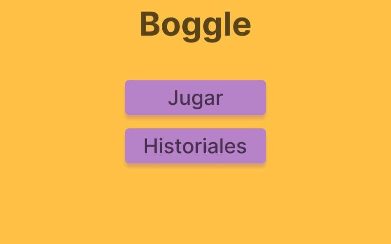
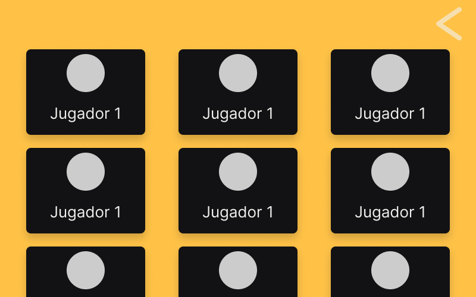
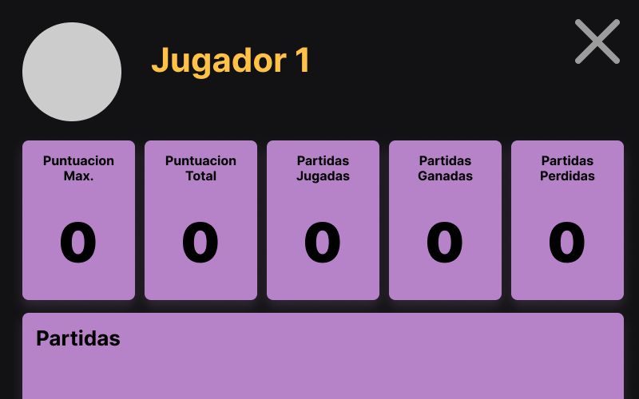
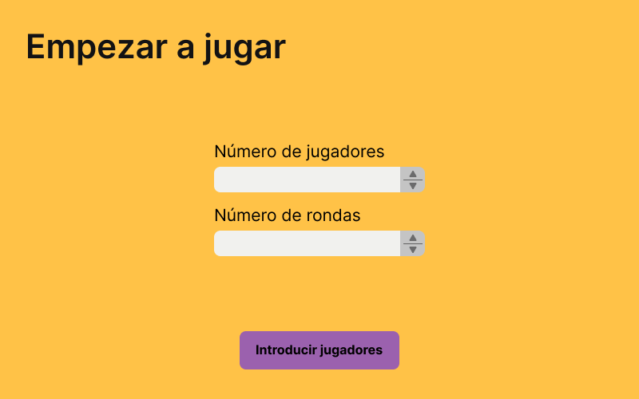
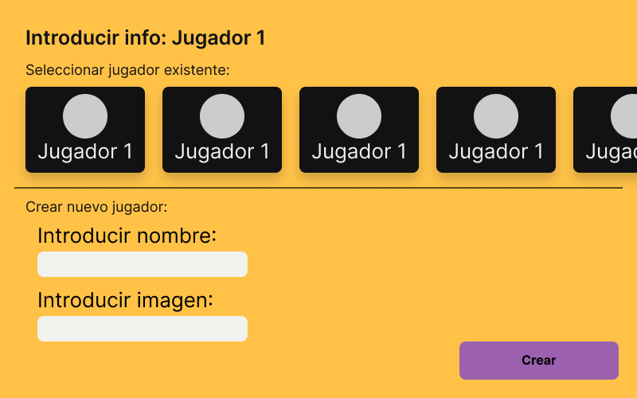
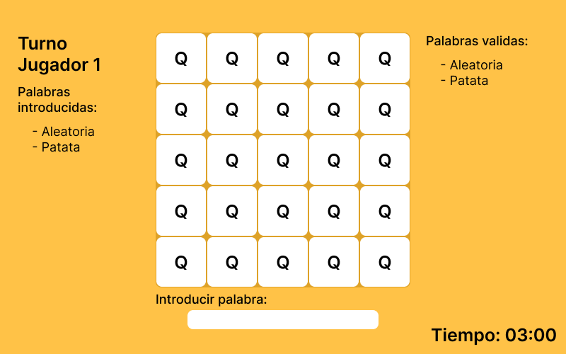
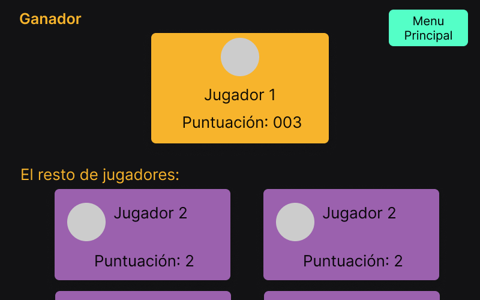
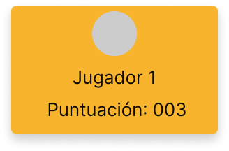

# Boggle

En esta ventana se usa el MainController.java y el main.fxml

En esta ventana se usa el HistoryController.java y el history.fxml

En esta ventana se usa el IndividualContrller.java y el individual.fxml

En esta ventana se usa el InfoPartidaController.java y el infoPartida.fxml

En esta ventana se usa el AddPlayersController.java y el addPlayers.fxml

En esta ventana se usa el PartidaController.java y el partida.fxml

En esta ventana se usa el GanadoresController.java y el ganadores.fxml

Hay otras tres vistas y controladores que no se usan como tal, si no que son como componentes que se cargan en ciertas vistas para ahorrar trabajo. Estas son:

-  GanadorPlayerCellController.java usada en GanadoresController.java
-  PlayerCellController.java/PlayerSelectController.java usada en HistoryController.java/AddPlayersController.java respectivamente